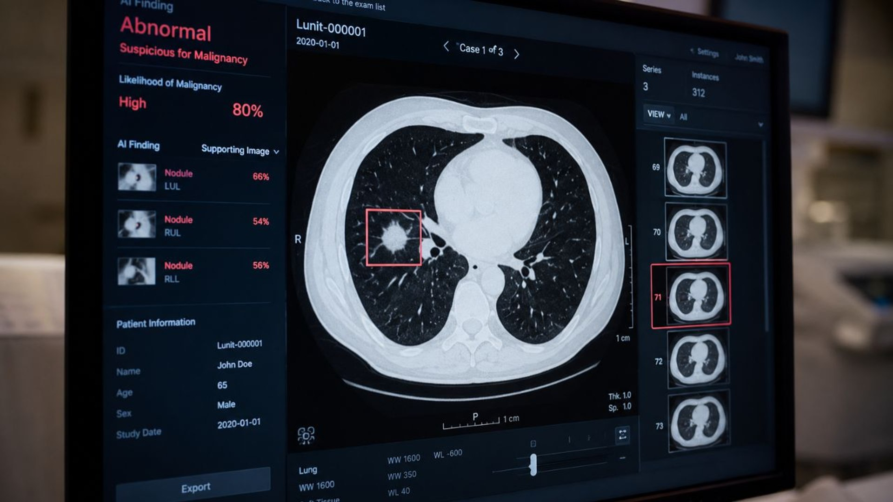

# CancerGuard-SVM-Cancer Detection-API

CancerGuard is a machine learning REST API for breast cancer prediction built with **FastAPI** and  **scikit-learn** . It uses a trained **Support Vector Machine (SVM)** classification model to predict whether a breast tumour is **malignant or benign** from diagnostic tumour measurements.

The project implements an end-to-end machine learning workflow covering data preprocessing, exploratory data analysis, feature scaling, SVM model training and optimisation, model evaluation and explainability, model serialization, REST API development, API-key authentication, automated testing, and interactive API documentation through Swagger UI.



## Key Features

* Breast cancer classification using a trained SVM model
* 30 diagnostic tumour measurements used as model inputs
* Standardised feature preprocessing using a saved `<span>StandardScaler</span>`
* Serialized model and preprocessing pipeline for inference
* FastAPI REST API for real-time predictions
* Prediction confidence/probability returned with each result
* API-key authentication for protected prediction requests
* Pydantic-based request validation
* `<span>/health</span>` endpoint for API health monitoring
* Interactive Swagger/OpenAPI documentation
* Automated API and model tests using `<span>pytest</span>`
* Prediction latency validation

## Dataset

The model is developed using the  **Wisconsin Breast Cancer Diagnostic dataset** , containing **569 observations and 30 numerical diagnostic features** derived from digitised images of breast mass fine-needle aspirates.

The target variable is:

* `<span>M</span>` — Malignant
* `<span>B</span>` — Benign

During model development, the target was encoded as:

```
Malignant (M) = 1
Benign (B)    = 0
```

Non-predictive identifier fields and empty CSV artifacts were removed before model training.

## Technology Stack

| Component            | Technology                   |
| -------------------- | ---------------------------- |
| Programming Language | Python                       |
| Machine Learning     | scikit-learn                 |
| ML Algorithm         | Support Vector Machine (SVM) |
| Data Processing      | pandas, NumPy                |
| Feature Scaling      | StandardScaler               |
| API Framework        | FastAPI                      |
| Data Validation      | Pydantic                     |
| Model Serialization  | joblib                       |
| API Server           | Uvicorn                      |
| API Documentation    | Swagger UI / OpenAPI         |
| Authentication       | API Key                      |
| Automated Testing    | pytest                       |
| Model Development    | Jupyter Notebook             |

## Project Architecture

CancerGuard follows a separation between offline machine-learning development and online API inference.

```
Breast Cancer Dataset
        │
        ▼
Data Cleaning & Preprocessing
        │
        ▼
Exploratory Data Analysis
        │
        ▼
Feature Scaling
        │
        ▼
SVM Training & Optimisation
        │
        ▼
Model Evaluation
        │
        ▼
Serialized Model + Scaler
        │
        ▼
FastAPI Application
        │
        ├── /health
        │
        └── /predict
                │
                ▼
        Prediction + Confidence
```

The trained model and scaler are loaded by the FastAPI application for inference, avoiding model retraining for every prediction request.

# How to Run

### STEP 1 — Create a Conda Environment

After opening the project repository, create a new Conda environment:

```
conda create -n cancerguard python=3.12 -y
```

Activate the environment:

```
conda activate cancerguard
```

### STEP 2 — Install the Requirements

Install all required project dependencies:

```
pip install -r requirements.txt
```

### STEP 3 — Configure the API Key

Create a `.env` file in the project root directory and add your API key:

```
API_KEY = "your_api_key_here"
```

The API key is required to access the protected `/predict<` endpoint.

> **Important:** Do not commit the `.env` file to GitHub. Make sure `.env` is included in `.gitignore`.

---

### STEP 4 — Start the FastAPI Server

Run the FastAPI application using Uvicorn:

```
uvicorn app.main:app --reload
```

Once the server starts successfully, the API will be available locally at:

```
http://127.0.0.1:8000
```

You can verify that the API is running using the health endpoint:

```
http://127.0.0.1:8000/health
```

A successful health check confirms that the CancerGuard API is running and ready to accept requests.

---

### STEP 5 — Open Swagger UI

FastAPI automatically provides interactive Swagger documentation.

After starting the server, open:

```
http://127.0.0.1:8000/docs
```

Swagger UI allows you to:

* View available API endpoints
* Inspect request and response schemas
* Enter the required API key
* Send prediction requests directly from the browser
* Inspect API responses and HTTP status codes


## API Endpoints

CancerGuard provides the following REST API endpoints:

| Method   | Endpoint     | Description                                      | Authentication |
| -------- | ------------ | ------------------------------------------------ | -------------- |
| `GET`  | `/`        | Root endpoint with basic API information         | No             |
| `GET`  | `/health`  | Checks API and model availability                | No             |
| `POST` | `/predict` | Predicts whether a tumour is malignant or benign | API Key        |
| `GET`  | `/docs`    | Interactive Swagger/OpenAPI documentation        | No             |

### Prediction Response

After submitting a valid request to the `/predict` endpoint, CancerGuard returns the model prediction together with the associated confidence score.

The prediction represents one of two classes:

* **`present`** — the model predicts cancer presence (malignant).
* **`absent`** — the model predicts cancer absence (benign).

The confidence value represents the model's estimated confidence/probability for the returned prediction.

### HTTP Status Codes

The API uses standard HTTP status codes to indicate whether a request was successful.

| Status Code | Meaning                                                      |
| ----------- | ------------------------------------------------------------ |
| `200`     | Request processed successfully                               |
| `401`     | API key is missing or invalid                                |
| `422`     | Request contains missing, malformed, or invalid input fields |
| `500`     | Internal model or server error                               |

Input validation is handled through FastAPI and Pydantic, while protected prediction requests require a valid API key.

---

### STEP 6 — Test the `<span>/predict</span>` Endpoint

Open the `<span>/predict</span>` endpoint in Swagger UI and click  **Try it out** .

Enter the required API key and provide all 30 breast cancer diagnostic features in the JSON request body.

Example:

```
{
  "radius_mean": 17.99,
  "texture_mean": 10.38,
  "perimeter_mean": 122.8,
  "area_mean": 1001.0,
  "smoothness_mean": 0.1184,
  "compactness_mean": 0.2776,
  "concavity_mean": 0.3001,
  "concave_points_mean": 0.1471,
  "symmetry_mean": 0.2419,
  "fractal_dimension_mean": 0.07871,
  "radius_se": 1.095,
  "texture_se": 0.9053,
  "perimeter_se": 8.589,
  "area_se": 153.4,
  "smoothness_se": 0.006399,
  "compactness_se": 0.04904,
  "concavity_se": 0.05373,
  "concave_points_se": 0.01587,
  "symmetry_se": 0.03003,
  "fractal_dimension_se": 0.006193,
  "radius_worst": 25.38,
  "texture_worst": 17.33,
  "perimeter_worst": 184.6,
  "area_worst": 2019.0,
  "smoothness_worst": 0.1622,
  "compactness_worst": 0.6656,
  "concavity_worst": 0.7119,
  "concave_points_worst": 0.2654,
  "symmetry_worst": 0.4601,
  "fractal_dimension_worst": 0.1189
}
```

Click **Execute** to send the request.

The API will validate the input, preprocess the features using the saved scaler, perform inference using the trained SVM model, and return the prediction result together with its confidence score.


### Example Prediction Response

For the example input shown above, the API returns:

```json
{
  "prediction": "present",
  "confidence": 0.9999809919981356
}
```

Where:

* `prediction` — predicted cancer status. The API returns `present` or `absent`.
* `confidence` — estimated probability/confidence associated with the model prediction.

In this example, the model predicts **cancer present** with approximately **99.998% confidence**.

A successful prediction request returns HTTP status code:

```text
200 OK
```

The `/predict` endpoint requires the API key to be supplied through the `X-API-Key` request header.


## Project Structure

The CancerGuard repository is organised into separate modules for machine learning development, API implementation, model artifacts, testing, and documentation.

```text
CancerGuard-SVM-Cancer-Detection-API/
│
├── app/
│   ├── __init__.py
│   ├── main.py
│   ├── schemas.py
│   ├── model_handler.py
│   ├── auth.py
│   └── config.py
│
├── artifacts/
│   └── feature_metadata.json
│
├── data/
│   └── Breast-Cancer_data.csv
│
├── models/
│   └── final_svm_pipeline.pkl
│
├── notebook/
│   ├── 01_Data_Understanding.ipynb
│   ├── 02_Data_Cleaning_Preprocessing.ipynb
│   ├── 03_Feature_Engineering.ipynb
│   ├── 04_Model_Training.ipynb
│   ├── 05_Model_Evaluation.ipynb
│   └── 06_Model_Explainability.ipynb
│
├── tests/
│   ├── __init__.py
│   ├── test_api.py
│   └── test_model.py
│
├── image/
│   └── README/
│       └── 1780090438479.png
│
├── .gitignore
├── LICENSE
├── README.md
└── requirements.txt
```

### Directory Overview

| Path                     | Purpose                                                       |
| ------------------------ | ------------------------------------------------------------- |
| `app/`                 | Contains the FastAPI application and API-related modules      |
| `app/main.py`          | Defines the FastAPI application and API endpoints             |
| `app/schemas.py`       | Defines Pydantic request and response schemas                 |
| `app/model_handler.py` | Handles loading and inference using the trained SVM model     |
| `app/auth.py`          | Handles API-key authentication                                |
| `app/config.py`        | Contains application configuration                            |
| `artifacts/`           | Stores supporting model metadata                              |
| `data/`                | Contains the breast cancer dataset used for model development |
| `models/`              | Stores the serialized final SVM pipeline                      |
| `notebook/`            | Contains the complete machine learning development workflow   |
| `tests/`               | Contains automated API and model tests                        |
| `image/README/`        | Stores images used in the project README                      |
| `requirements.txt`     | Lists Python dependencies required by the project             |
| `README.md`            | Main project documentation                                    |
| `LICENSE`              | Defines the project's software license                        |

### Machine Learning Workflow

The six Jupyter notebooks document the machine learning lifecycle sequentially:

```text
01_Data_Understanding
        ↓
02_Data_Cleaning_Preprocessing
        ↓
03_Feature_Engineering
        ↓
04_Model_Training
        ↓
05_Model_Evaluation
        ↓
06_Model_Explainability
        ↓
final_svm_pipeline.pkl
        ↓
FastAPI Inference
```


## Testing

CancerGuard includes an automated test suite built with **pytest** to validate both the FastAPI service and the trained machine learning model.

### Run the Tests

From the project root directory, run:

```bash
pytest -v
```

The test suite contains **8 automated tests** across the API and model layers.

### API Tests

The `tests/test_api.py` module validates the behaviour, security, input validation, and performance of the REST API.

| Test                             | Purpose                                                                  |
| -------------------------------- | ------------------------------------------------------------------------ |
| `test_health_endpoint`         | Verifies that the`/health` endpoint is available                       |
| `test_predict_valid_input`     | Confirms that valid input returns a successful prediction                |
| `test_predict_missing_field`   | Verifies validation when a required feature is missing                   |
| `test_predict_missing_api_key` | Confirms that requests without an API key are rejected                   |
| `test_predict_invalid_api_key` | Confirms that requests with an invalid API key are rejected              |
| `test_predict_latency`         | Verifies that prediction response time meets the required latency target |

### Model Tests

The `tests/test_model.py` module validates that the serialized machine learning model can be loaded and used successfully for inference.

| Test                       | Purpose                                                   |
| -------------------------- | --------------------------------------------------------- |
| `test_model_loads`       | Confirms that the serialized SVM model loads successfully |
| `test_model_can_predict` | Confirms that the loaded model can generate predictions   |

### Test Results

The complete test suite passes successfully:

```text
collected 8 items

tests/test_api.py::test_health_endpoint PASSED
tests/test_api.py::test_predict_valid_input PASSED
tests/test_api.py::test_predict_missing_field PASSED
tests/test_api.py::test_predict_missing_api_key PASSED
tests/test_api.py::test_predict_invalid_api_key PASSED
tests/test_api.py::test_predict_latency PASSED
tests/test_model.py::test_model_loads PASSED
tests/test_model.py::test_model_can_predict PASSED
```

**Result: 8/8 tests passed.**

The successful test suite verifies the API health check, prediction functionality, request validation, API-key authentication, prediction latency, model loading, and model inference.


## Model Performance

The final CancerGuard SVM model was evaluated on an independent held-out test set using classification metrics appropriate for breast cancer detection.

### Operating Threshold Selection

Rather than automatically using the conventional probability threshold of `0.50`, the operating threshold was selected using **out-of-fold (OOF) probability estimates generated exclusively from the training data**.

A minimum malignant sensitivity criterion of **98%** was applied during threshold selection. Among the candidate thresholds satisfying this criterion, a threshold of **0.30** achieved the highest specificity and was selected as the experimental operating threshold.

Using training-only OOF predictions for threshold optimisation prevents information from the independent test set from influencing threshold selection.

### Final Test-Set Performance

At the selected operating threshold of `0.30`, the model achieved:

| Metric               |           Result |
| -------------------- | ---------------: |
| Accuracy             | **98.25%** |
| Precision (PPV)      | **97.62%** |
| Sensitivity (Recall) | **97.62%** |
| Specificity          | **98.61%** |
| F1 Score             | **97.62%** |
| False Positives      |      **1** |
| False Negatives      |      **1** |

### Threshold Comparison

Compared with the conventional `0.50` probability threshold, the selected `0.30` threshold reduced the number of **false-negative predictions from 2 to 1** while maintaining the same overall accuracy, at the cost of one additional false-positive prediction.

Reducing false negatives was prioritised because a false-negative prediction represents a malignant case incorrectly classified as benign.

The `0.30` threshold is therefore retained as the **experimental operating threshold** for the CancerGuard prototype.

> **Important:** The selected threshold and reported performance are experimental results obtained on the project dataset. The `0.30` threshold is **not a clinically validated diagnostic cutoff** and would require external validation before consideration for any clinical application.


## Limitations & Disclaimer

CancerGuard is an **educational and experimental machine learning project** designed to demonstrate an end-to-end workflow for breast cancer classification using Support Vector Machines and FastAPI.

### Limitations

* The model was developed and evaluated using the **Wisconsin Breast Cancer Diagnostic dataset**, which contains 569 observations. Performance on this dataset does not guarantee equivalent performance on other patient populations or clinical datasets.
* The reported performance metrics are based on an internal held-out test set and have **not been independently or externally validated**.
* The model relies on 30 numerical diagnostic features derived from breast mass measurements and cannot make predictions when the required measurements are unavailable.
* The experimental operating threshold of `0.30` was selected using out-of-fold training predictions to prioritise malignant-case sensitivity. It is **not a clinically established diagnostic threshold**.
* Model probabilities and confidence scores should not be interpreted as definitive clinical probabilities of cancer.
* The API uses API-key authentication as a basic security mechanism. Additional security, access control, monitoring, encryption, and infrastructure controls would be required for a production healthcare system.
* The current system is designed for individual REST API inference and does not provide real-time streaming or production-scale clinical integration.
* Model performance may be affected by dataset shift, differences in measurement procedures, patient populations, or data quality.

### Medical Disclaimer

> **CancerGuard is not a medical device and is not intended for clinical diagnosis, treatment decisions, or replacement of professional medical judgement.**
>
> Predictions generated by this project are for **educational, research, and software demonstration purposes only**. The model and its `0.30` operating threshold have not undergone clinical validation, regulatory review, or external validation required for use in real-world healthcare decision-making.

Any potential clinical application would require substantially broader validation, appropriate healthcare governance, security and privacy controls, regulatory assessment, and evaluation by qualified medical professionals.
